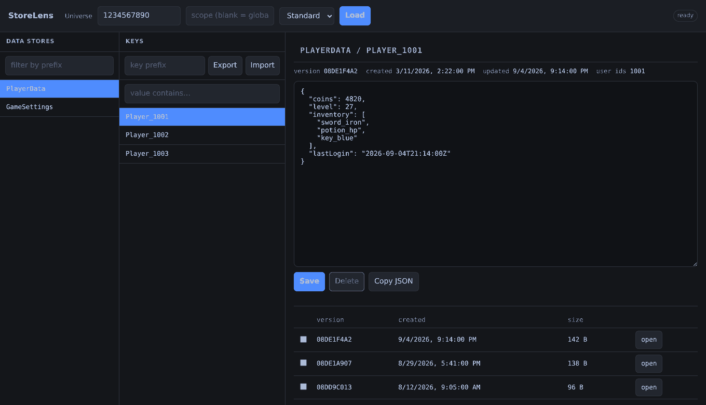

# StoreLens

A small local dashboard for reading and editing Roblox DataStores. Runs on your
machine, talks to the Open Cloud API, no Studio session required.



## Why

Debugging save systems used to mean opening Studio, writing a throwaway script to
read one key, squinting at the Output window, then writing another script to fix
the value. That loop is slow and it's easy to write garbage back by accident.

This does the same thing in a browser tab: pick a data store, pick a key, look at
the JSON, fix it, save. Version history is right there if you need to roll back.

## Setup

Node 20 or newer. There are no dependencies, so there's nothing to install.

```
git clone https://github.com/<you>/StoreLens.git
cd StoreLens
cp .env.example .env
npm start
```

Open http://localhost:3000.

### Getting an API key

1. Open the Creator Dashboard's
   [Credentials page](https://create.roblox.com/dashboard/credentials), **API Keys**
   tab, and create a key.
2. Give it a name you'll recognise later.
3. Under **Access Permissions**, choose the data stores system from the
   **Select API System** menu and add the experience you want to reach. (You can
   turn off **Restrict by Experience** instead, but a key scoped to one universe
   does less damage if it leaks.)
4. Tick the operations in **Select Operations** - see the table below.
5. Under **Security**, add an IP or CIDR range. `0.0.0.0/0` allows any address,
   which is the pragmatic choice on a home connection whose IP moves.
6. Optionally set an expiry date.
7. **Save & Generate key**. The key is shown exactly once - copy it now.

Which operations you need:

| you want to | tick |
|---|---|
| see the list of data stores | `universe-datastores.control:list` |
| see the keys inside one | `universe-datastores.objects:list` |
| open a key and read its value | `universe-datastores.objects:read` |
| save an edit or create a key | `objects:create` and `objects:update` |
| delete a key | `objects:delete` |

`control:list` is the one people miss. Without it the Data Stores column just
stays empty on load, which looks like a broken key rather than a missing scope.
If version history is the only thing that 403s, add the versions read operation
too.

If you only want to look around, leave the write operations off entirely and run
with `READ_ONLY=true`. Two locks are better than one.

Put the key in `.env` as `ROBLOX_API_KEY`. Never commit that file - `.gitignore`
already has it.

For the Ordered dropdown to work, add the ordered data stores system as a second
API system on the same key. It's a separate service, so a key that reads standard
stores fine will still 401 on ordered ones.

### Finding your universe id

In the Creator Dashboard, hover over the experience's thumbnail, click the **...**
button, and pick **Copy Universe ID**.

That is *not* the place id. The place id is the number in a place's configure URL
and it will not work here. In Studio, `game.GameId` gives you the universe id and
`game.PlaceId` gives you the place id.

Put it in `.env` as `ROBLOX_UNIVERSE_ID` to have it loaded on startup, or paste it
into the field in the header.

## Config

| var | default | |
|---|---|---|
| `ROBLOX_API_KEY` | - | required |
| `ROBLOX_UNIVERSE_ID` | - | loaded on startup if set |
| `PORT` | 3000 | |
| `HOST` | 127.0.0.1 | don't bind this to 0.0.0.0 |
| `READ_ONLY` | false | `true` blocks writes and deletes |
| `ROBLOX_TIMEOUT_MS` | 15000 | request deadline, prevents a hung dashboard |
| `ROBLOX_API_BASE` | Open Cloud | override for local testing |
| `ROBLOX_ORDERED_API_BASE` | Open Cloud | same, for ordered stores |
| `BACKUP_INTERVAL_MIN` | 0 | 0 is off, minimum 5 |
| `BACKUP_DIR` | `backups` | git-ignored, it holds real player data |
| `BACKUP_STORES` | all | comma separated |
| `BACKUP_KEEP` | 7 | files kept per store |
| `BACKUP_MAX_ENTRIES` | 2000 | same cap as a manual export |
| `UNDO_DIR` | `backups/undo` | what each import replaced |

## When it doesn't work

| what you see | what it usually is |
|---|---|
| Data Stores column empty, no error | key is missing `universe-datastores.control:list` |
| 401 on every request | key wrong, expired, or your IP isn't in the key's allow list |
| 401 only on the Ordered tab | the ordered data stores system isn't on the key |
| 403 / "Insufficient scope" | the specific operation isn't ticked |
| 404 on a store you can see in Studio | universe id is actually a place id, or the scope is wrong (blank means `global`) |
| 412 when saving | someone wrote to that key after you loaded it - reload and redo the edit |
| 429 | Open Cloud rate limit; the message tells you how long to wait |
| 504 | the request outlived `ROBLOX_TIMEOUT_MS` |
| "Cross-site request blocked" | something other than the dashboard called the server - that's the guard working |

A data store that exists but has never been written to won't show up. Open Cloud
only lists stores that hold at least one entry.

## A few things worth knowing

The API key stays in the Node process. It's never sent to the browser, so nothing
running on the page can read it.

Saves use `matchVersion`. The version you loaded gets sent back with the write, and
Open Cloud rejects it with a 412 if the key changed in the meantime. If a player
saved while you had the editor open, your write fails instead of wiping their
progress. Reload and redo the edit.

Deletes are soft - old versions stick around for about 30 days and you can pull
them back from the version list.

There's no auth on this thing at all, which is why it binds to localhost. Don't
put it on a server.

Because it binds to localhost, any website you have open in the same browser could
otherwise talk to it. The server therefore rejects requests carrying a foreign
`Origin` or `Sec-Fetch-Site: cross-site`, and requires `Content-Type: application/json`
on writes.

It also refuses any request whose `Host` is not `localhost`, `127.0.0.1` or
`[::1]`. Comparing `Origin` against `Host` is not enough on its own: in a DNS
rebinding attack a page on someone else's domain points that domain at
127.0.0.1, and then both headers say the attacker's name and agree with each
other. Pinning the host is what actually closes that. The practical cost is that
a hostname you mapped to 127.0.0.1 yourself will get a 403 - use localhost.

Keep all of that in place if you fork this.

If you're touching a live game, run with `READ_ONLY=true` and only turn it off for
the minute you actually need to fix something.

## HTTP API

The frontend is just a client for this, so you can script against it directly.

```
GET    /api/health
GET    /api/datastores?prefix=&cursor=
GET    /api/keys?datastore=&prefix=&cursor=
GET    /api/entry?datastore=&key=
POST   /api/entry              {datastore, key, value, matchVersion}
DELETE /api/entry?datastore=&key=
GET    /api/versions?datastore=&key=
GET    /api/version?datastore=&key=&versionId=
GET    /api/export?datastore=&prefix=&max=
GET    /api/search?datastore=&prefix=&contains=&caseSensitive=&max=
POST   /api/import           {datastore, payload, mode, dryRun}
GET    /api/imports
POST   /api/import/undo      {id, dryRun}
GET    /api/backups
POST   /api/backups/run

GET    /api/ordered/entries?store=&limit=&pageToken=&ascending=
GET    /api/ordered/entry?store=&entry=
POST   /api/ordered/entry     {store, entry, value}      set
POST   /api/ordered/entry     {store, entry, increment}  atomic add
DELETE /api/ordered/entry?store=&entry=
```

All of them take optional `universeId` and `scope`.

## Ordered data stores

Switch the dropdown in the header from Standard to Ordered. These hold integers
only and stay sorted, which is what leaderboards are built on. There's no API to
list them, so type the store name exactly and press Enter. Entries come back
highest first; you can set a value outright or use `+1`/`-1`, which goes through
Open Cloud's atomic increment so two writers can't clobber each other.

## Export

The Export button in the Keys column walks every key in the selected data store
and downloads them as one JSON file. The key prefix filter applies, so you can
export just `Player_` if that's all you need. It's capped at 2000 entries by
default (`max` on the endpoint, hard limit 20000) to keep a stray click from
eating your universe's rate limit. Keys that fail to read are listed under
`failures` instead of killing the run.

## Import

The Import button takes a file you exported earlier and writes it back. It runs a
dry pass first, tells you how many keys are new and how many already exist, and
lets you choose: overwrite everything, or only create the missing ones. Then it
asks once more before touching anything. Blocked entirely in read-only mode.

The file can be a whole export or just its `entries` array. Limit is 5000 rows
per file, and writes go one at a time on purpose - this touches live player saves.

## Scheduled backups

Set `BACKUP_INTERVAL_MIN` and the server exports your stores to `BACKUP_DIR` on
a timer, keeping the newest `BACKUP_KEEP` files per store and dropping the rest.
Leave `BACKUP_STORES` empty to back up every store the key can see, or list the
ones you care about.

It is the same walk as clicking Export, so the same cap applies and the same
rate limit gets spent. Pick an interval you would be happy paying for every day.

Two deliberate choices: the first run happens one interval after startup, not at
startup, or `node --watch` would hit Open Cloud on every file save. And backups
keep running in read-only mode, because reading is all they do.

Files are named `<store>--<timestamp>.json`, and retention is worked out per
store from that timestamp, so a store called `Player--Data` keeps its own set
and cannot eat the backups of one called `Player`. Store names that are not
valid filenames get a short `~hash` suffix, so `Player Data` and `Player_Data`
stay separate files instead of quietly overwriting each other. Anything else you
leave in the directory is ignored rather than counted and pruned.

A run that reads nothing is treated as a failure, not as an empty store: no file
is written and nothing is pruned. That matters because Open Cloud rate limiting
comes back as unreadable keys rather than as an error, so without this a few
throttled runs would replace every good backup with an empty one. Retention only
ever touches stores that got a fresh, usable file in that same run.

`BACKUP_MAX_ENTRIES` and `BACKUP_INTERVAL_MIN` are checked at startup. A value
the exporter would reject stops backups from starting and says why, instead of
failing quietly on every run.

`POST /api/backups/run` triggers one immediately, `GET /api/backups` lists what
is on disk. `BACKUP_DIR` is git-ignored - those files are real player saves.

## Undoing an import

Before an import overwrites a key, StoreLens notes which version was there. That
note is what Undo import replays.

The button sits next to the value search and lights up once an import has run.
It does a dry pass first and tells you exactly what will happen: how many
entries go back to their old value, how many the import created and will be
deleted. Then it asks.

Three things worth being clear about:

- Undo does not rewind history. It writes the old value back as a **new**
  version. The import is still in the version list.
- Keys the import created get deleted, which on Open Cloud is a soft delete, so
  they are recoverable from the version list for about 30 days either way.
- There is no `matchVersion` on an undo, on purpose. Undo is what you reach for
  when the import was wrong, and it should not fail because the bad value got
  written again in the meantime. The flip side is that it overwrites anything
  newer, so undo while the mistake is still fresh.

Each row in the journal records the scope the import actually wrote to, which is
not always the scope in the header: an export file carries a scope per entry and
that wins. Undo follows the row, so it cannot edit or delete a key in a scope
the import never touched.

Each journal also records the universe it was made against. Undo refuses to run
if the universe in the header is a different one, and the Undo button only
offers imports belonging to the universe you are looking at.

The journal is written before the first key is overwritten and flushed as the
import runs, so killing the process halfway still leaves you something to undo.

If the journal is gone (you cleaned out `backups/`), undo has nothing to replay
and says so. The version history is still there.

## Finding a key by its contents

Open Cloud can only filter by key prefix, so the "value contains" box reads the
entries and matches locally. That means it costs the same as an export and is
capped the same way, but it answers questions the key list can't: which saves
still have the old `tutorialStep` field, who owns the duped sword, and so on.
Combine it with the key prefix to narrow the scan first.

## Comparing versions

Tick two rows in the version history and hit Compare selected for a side by side
diff. Useful for "what did this player's save look like before the patch".

## TODO

- Restore straight from a backup file, without the export/import round trip
- Diff a backup against what is live right now

PRs welcome.

## Dev

```
npm run dev    # node --watch
npm test
npm run lint
```

Tests use `node:test`. To poke at the UI without a real universe, point
`ROBLOX_API_BASE` at a local mock server.

## Contact

Found a bug or something's broken? Reach out on Discord: **officialacestar**

## License

MIT
